# QuoteVault
 
**QuoteVault** is a modern, feature-rich Android application for discovering, collecting, and sharing inspirational quotes. Built with Jetpack Compose, MVVM architecture, and powered by Supabase backend, it provides a seamless experience for quote enthusiasts to organize and share their favorite words of wisdom.


## Features

- **Extensive Quote Library**
  - Browse quotes across multiple categories: Motivation, Love, Success, Wisdom, Humor
  - Search quotes by text, author, or category
  - Quote of the Day feature with automatic updates

- **Personalization**
  - Save favorite quotes for quick access
  - Create custom collections to organize quotes
  - Add quotes to collections for better categorization
  - Customize app appearance (Theme, Font Size, Accent Color)

- **Sharing Capabilities**
  - Share quotes as text to any app
  - Generate beautiful quote card images
  - Share crafted images to social media platforms
  - Copy quotes to clipboard

- **Notifications & Widgets**
  - Daily quote notifications at user-specified times
  - Home screen widget for constant inspiration
  - Background quote syncing with remote database

- **User Account**
  - Secure authentication via Supabase Auth
  - User profiles with avatar support
  - Sync favorites and collections across devices

### Technical Features

- **Offline Support**: Local Room database with offline caching
- **Network Monitoring**: Handles connectivity gracefully
- **Pagination**: Efficient loading with Paging 3
- **Dark Mode**: Full system theme support
- **Accessibility**: Material Design accessibility guidelines
- **Custom Fonts**: Beautiful typography with multiple font families

---
# Screenshots

## Authentication Screens
<table>
  <tr>
    <td align="center">
      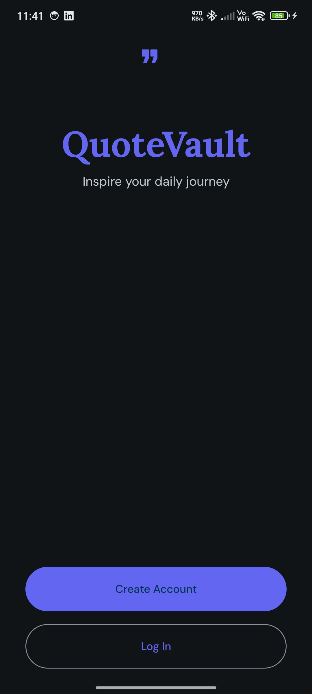
      <br/>
      <b>Home</b>
    </td>
    <td align="center">
      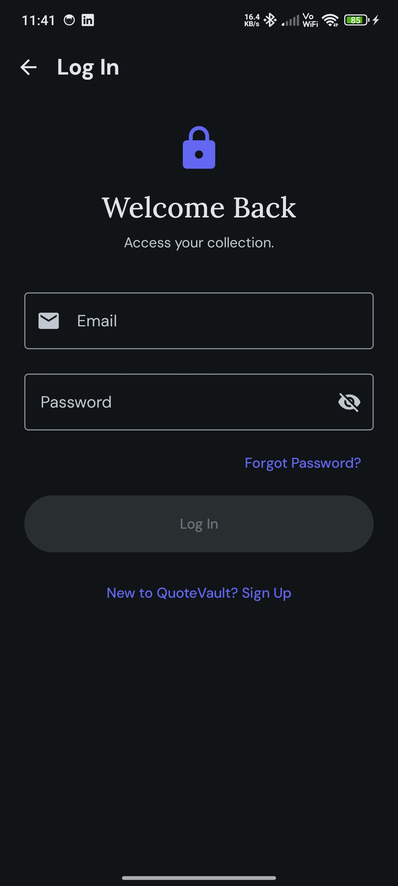
      <br/>
      <b>Login</b>
    </td>
    <td align="center">
      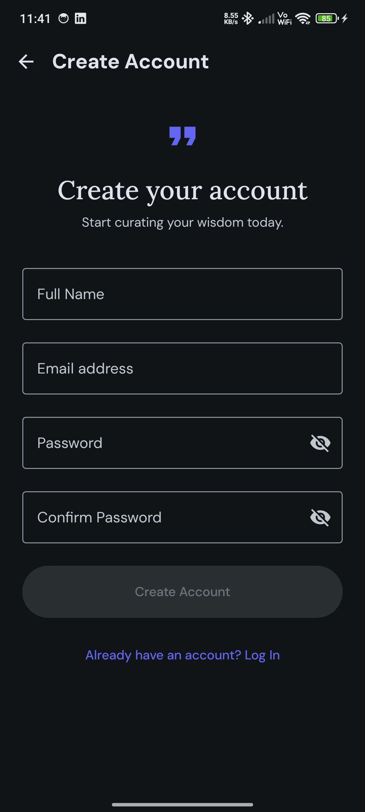
      <br/>
      <b>Sign Up</b>
    </td>
    <td align="center">
      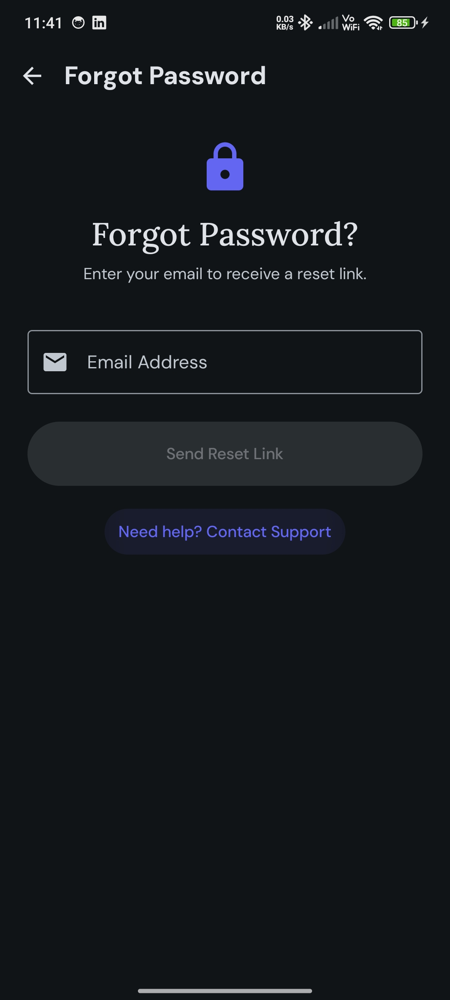
      <br/>
      <b>Forgot Password</b>
    </td>
  </tr>
</table>

## Quotes & Favorites
<table>
  <tr>
    <td align="center">
      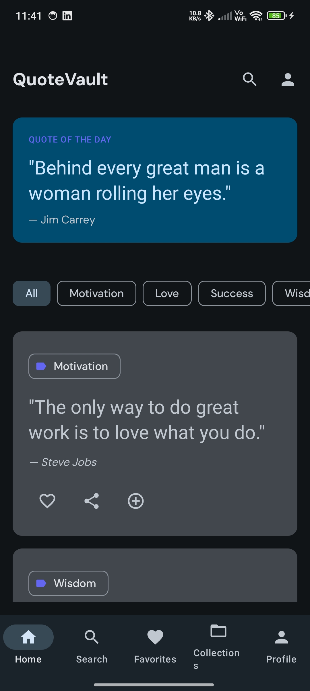
      <br/>
      <b>Quotes</b>
    </td>
    <td align="center">
      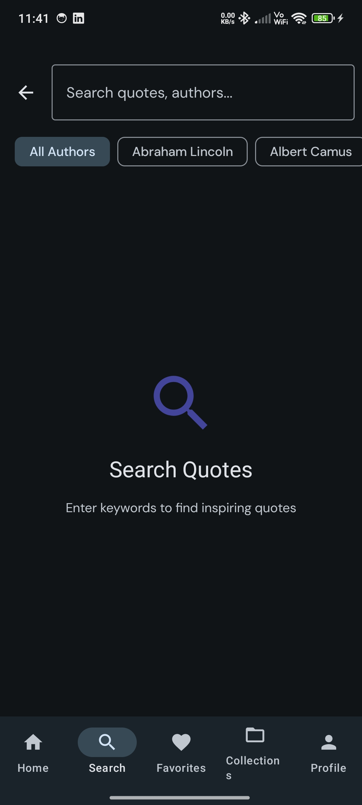
      <br/>
      <b>Search</b>
    </td>
    <td align="center">
      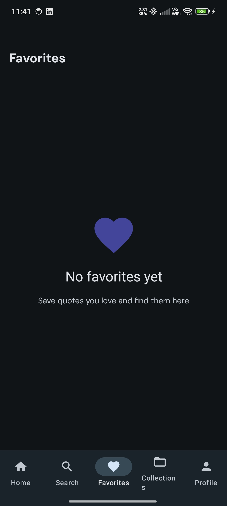
      <br/>
      <b>Favorites</b>
    </td>
    <td align="center">
      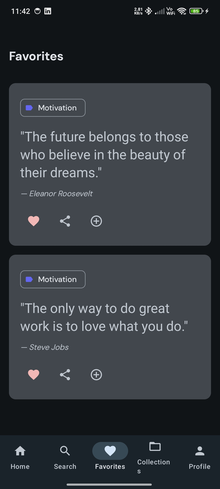
      <br/>
      <b>Added to Favorites</b>
    </td>
  </tr>
</table>

## Collections
<table>
  <tr>
    <td align="center">
      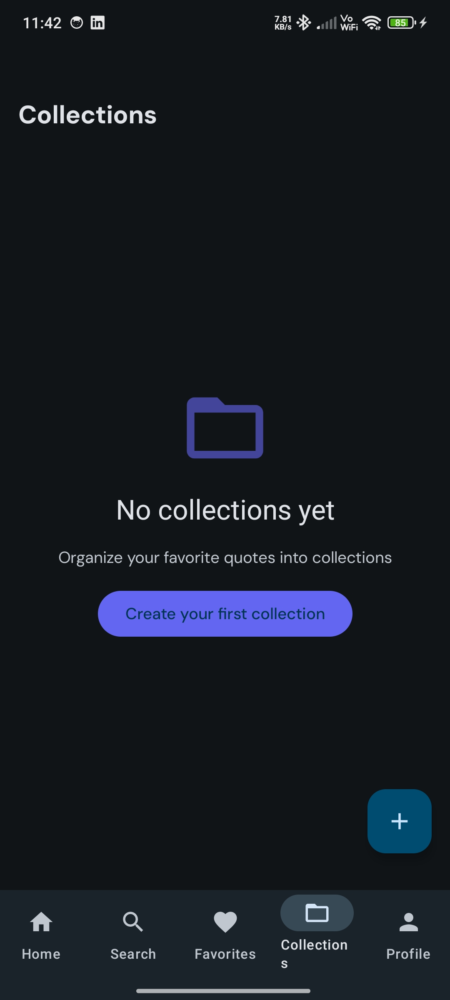
      <br/>
      <b>Collections</b>
    </td>
    <td align="center">
      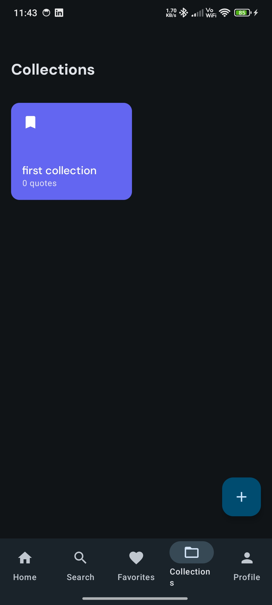
      <br/>
      <b>Collection Detail</b>
    </td>
    <td align="center">
      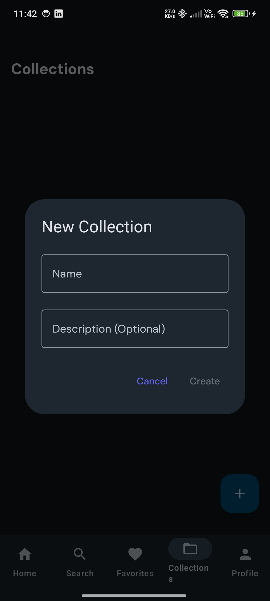
      <br/>
      <b>Add Collection</b>
    </td>
    <td align="center">
      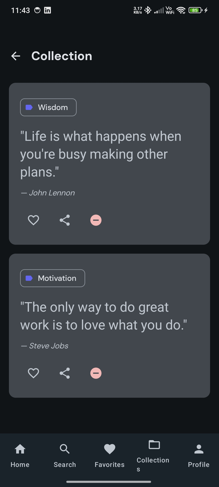
      <br/>
      <b>Collection Added</b>
    </td>
  </tr>
</table>

## User Settings & Widget
<table>
  <tr>
    <td align="center">
      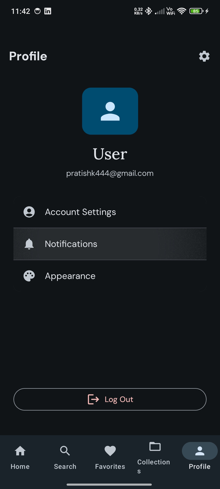
      <br/>
      <b>Profile</b>
    </td>
    <td align="center">
      
      <br/>
      <b>Settings</b>
    </td>
    <td align="center">
      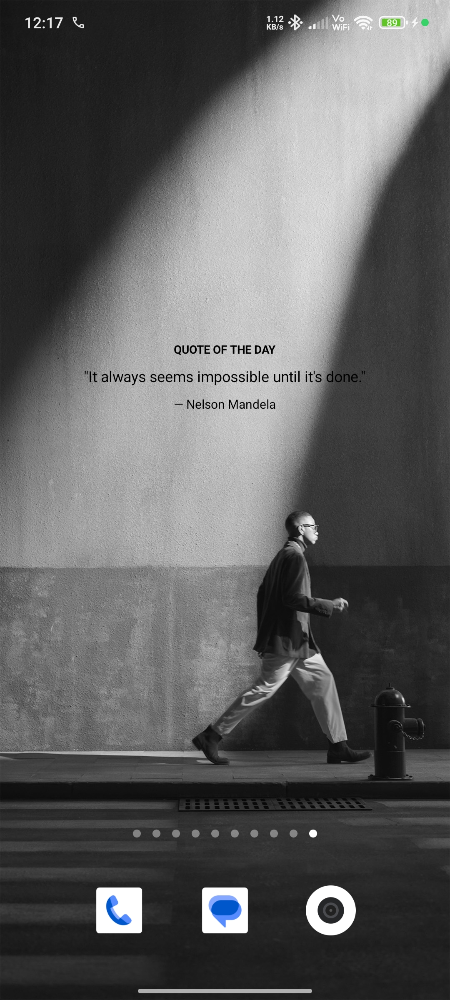
      <br/>
      <b>Widget</b>
    </td>
  </tr>
</table>

## Tech Stack

### Frameworks & Libraries

| Category | Tool/Library | Version | Purpose |
|----------|-------------|---------|---------|
| **UI Framework** | Jetpack Compose | BOM 2024.02.00 | Modern declarative UI |
| **Architecture** | MVVM + Clean Architecture | - | Separation of concerns |
| **DI Framework** | Hilt | 2.50 | Dependency injection |
| **Async** | Coroutines | 1.7.3 | Asynchronous programming |
| **Networking** | Ktor | 2.3.7 | HTTP client & networking |
| **Backend** | Supabase (BOM) | 2.6.1 | Backend-as-a-Service |
| **Local Database** | Room | 2.6.1 | Local data persistence |
| **Pagination** | Paging 3 | 3.2.1 | Efficient list loading |
| **Work Manager** | WorkManager | 2.9.0 | Background tasks |
| **Widgets** | Glance | 1.0.0 | App widgets |
| **Image Loading** | Coil | 2.5.0 | Image loading & caching |
| **Preferences** | DataStore | 1.0.0 | Secure preferences storage |
| **Navigation** | Navigation Compose | 2.7.7 | Screen navigation |
| **Material Design** | Material 3 | - | Design system |
| **Logging** | Timber | 5.0.1 | Logging |

### Development Tools

- **Kotlin**: Primary language
- **KSP**: Kotlin Symbol Processing (for Room & Hilt code generation)
- **Gradle**: Build system with Kotlin DSL
- **Git**: Version control

---

## Project Architecture

QuoteVault follows **Clean Architecture** principles with a clear separation of concerns:

### Architecture Layers

```
┌─────────────────────────────────────┐
│         UI Layer (Presentation)      │
│  (Screens, ViewModels, Composables) │
└─────────────┬───────────────────────┘
              │
┌─────────────▼───────────────────────┐
│       Domain Layer (Business)       │
│       (Models, Use Cases)           │
└─────────────┬───────────────────────┘
              │
┌─────────────▼───────────────────────┐
│       Data Layer (Repository)       │
│  (Local, Remote, Mappers, DTOs)    │
└─────────────────────────────────────┘
```
## AI Tools Used

| Tool               | Purpose                 | Usage                                                                 |
|--------------------|-------------------------|-----------------------------------------------------------------------|
| Claude (Anthropic) | Primary coding assistant | Architecture design, code generation, documentation, debugging        |
| GLM 4.7            | Code completion          | Real-time code suggestions and completions                            |
| Firebender         | IDE assistance           | Code editing, refactoring, and inline suggestions                     |
| ChatGPT            | Problem solving          | Debugging complex issues, algorithm optimization                      |

---
##  Design Resources

### UI/UX Design

- **Design Tool:** Stitch
- **Design System:** Material Design 3
- **Color Palette:** Custom accent colors with full Dark / Light theme support
- **Typography:** DM Sans, Lora, and Merriweather font families

- **Design Files:** [View on Stitch](https://stitch.withgoogle.com/projects/6479263854545674579?pli=1)

## Project Structure

```
app/src/main/java/com/yourcompany/quotevault/
├── data/                    # Data layer
│   ├── local/              # Room database
│   ├── remote/             # Supabase API
│   ├── repository/         # Repository implementations
│   └── preferences/        # DataStore
│
├── domain/                  # Domain layer
│   └── model/              # Business models
│
├── di/                      # Dependency Injection (Hilt)
│
├── ui/                      # Presentation layer
│   ├── components/         # Reusable UI components
│   ├── screens/            # Screen implementations
│   ├── navigation/         # Navigation setup
│   └── theme/              # App theming
│
├── utils/                   # Utility classes
├── widget/                  # App widget
├── workers/                 # Background workers
├── MainActivity.kt
└── QuoteVaultApplication.kt
```

---
### Navigation Graph

```
Welcome -> Login/SignUp -> Home (Authenticated)
                      ↓
                   Bottom Navigation:
                   - Home
                   - Search
                   - Favorites
                   - Collections -> Collection Detail
                   - Profile -> Settings
```

---
## Setup Instructions

### Prerequisites

- **Android Studio**: Hedgehog (2023.1.1) or later
- **JDK**: 17 or higher
- **Android SDK**: API Level 34
- **Gradle**: Version configured in `gradle/wrapper/gradle-wrapper.properties`
- **Supabase Account**: Free tier account ([supabase.com](https://supabase.com))

### Step 1: Clone the Repository

```bash
git clone https://github.com/pratish444/QuoteVault
cd QuoteVault
```

### Step 2: Configure Supabase

1. **Create a Supabase Project**
   - Go to [supabase.com](https://supabase.com) and sign up
   - Create a new project
   - Wait for project initialization (~2 minutes)

2. **Get Project Credentials**
   - Navigate to **Project Settings** → **API**
   - Copy the **Project URL** and **Anon (public) Key**

3. **Configure `local.properties`**

   Copy `local.properties.example` to `local.properties`:

   ```bash
   cp local.properties.example local.properties
   ```

   Edit `local.properties` and add your Supabase credentials:

   ```properties
   # Your Supabase Project URL (e.g., https://your-project.supabase.co)
   SUPABASE_URL=https://your-project.supabase.co

   # Your Supabase Anon Key (found in Project Settings > API)
   SUPABASE_ANON_KEY=your-anon-key-here
   ```

   ⚠️ **Important**: Never commit `local.properties` to version control. It's already in `.gitignore`.

### Step 3: Set Up Database Tables

Go to your Supabase **SQL Editor** and run the following script:

```sql
-- Enable UUID extension
create extension if not exists "uuid-ossp";

-- User Profiles Table
create table user_profiles (
    id uuid primary key references auth.users(id) on delete cascade,
    display_name text,
    avatar_url text,
    created_at timestamp with time zone default timezone('utc'::text, now())
);

-- Quotes Table
create table quotes (
    id uuid primary key default uuid_generate_v4(),
    text text not null,
    author text not null,
    category text not null,
    source text,
    created_at timestamp with time zone default timezone('utc'::text, now())
);

-- User Favorites Table
create table user_favorites (
    id uuid primary key default uuid_generate_v4(),
    user_id uuid references user_profiles(id) on delete cascade,
    quote_id uuid references quotes(id) on delete cascade,
    created_at timestamp with time zone default timezone('utc'::text, now()),
    unique(user_id, quote_id)
);

-- Collections Table
create table collections (
    id uuid primary key default uuid_generate_v4(),
    user_id uuid references user_profiles(id) on delete cascade,
    name text not null,
    description text,
    color text not null,
    icon text not null,
    created_at timestamp with time zone default timezone('utc'::text, now())
);

-- Collection Quotes Junction Table
create table collection_quotes (
    collection_id uuid references collections(id) on delete cascade,
    quote_id uuid references quotes(id) on delete cascade,
    created_at timestamp with time zone default timezone('utc'::text, now()),
    primary key (collection_id, quote_id)
);

-- Daily Quotes Table
create table daily_quotes (
    date date primary key,
    quote_id uuid references quotes(id),
    created_at timestamp with time zone default timezone('utc'::text, now())
);

-- Create indexes for better performance
create index idx_quotes_category on quotes(category);
create index idx_quotes_author on quotes(author);
create index idx_favorites_user on user_favorites(user_id);
create index idx_collections_user on collections(user_id);
create index idx_collection_quotes_collection on collection_quotes(collection_id);
create index idx_collection_quotes_quote on collection_quotes(quote_id);
```

### Step 4: Set Up Row Level Security (RLS)

Enable security policies in Supabase **SQL Editor**:

```sql
-- Enable RLS on all tables
alter table user_profiles enable row level security;
alter table user_favorites enable row level security;
alter table collections enable row level security;
alter table collection_quotes enable row level security;
-- quotes table has public read access

-- User Profiles: Users can view their own data
create policy "Users can view own profile"
    on user_profiles for select
    using (auth.uid() = id);

create policy "Users can update own profile"
    on user_profiles for update
    using (auth.uid() = id);

insert into user_profiles (id)
select id from auth.users
where not exists (select 1 from user_profiles where user_profiles.id = auth.users.id);

-- Favorites: Users can view and manage their own favorites
create policy "Users can view own favorites"
    on user_favorites for select
    using (auth.uid() = user_id);

create policy "Users can insert own favorites"
    on user_favorites for insert
    with check (auth.uid() = user_id);

create policy "Users can delete own favorites"
    on user_favorites for delete
    using (auth.uid() = user_id);

-- Collections: Users can view and manage their own collections
create policy "Users can view own collections"
    on collections for select
    using (auth.uid() = user_id);

create policy "Users can insert own collections"
    on collections for insert
    with check (auth.uid() = user_id);

create policy "Users can update own collections"
    on collections for update
    using (auth.uid() = user_id);

create policy "Users can delete own collections"
    on collections for delete
    using (auth.uid() = user_id);

-- Collection Quotes: Users can view quotes in their own collections
create policy "Users can view quotes in own collections"
    on collection_quotes for select
    using (
        exists (
            select 1 from collections
            where collections.id = collection_quotes.collection_id
            and collections.user_id = auth.uid()
        )
    );

create policy "Users can add quotes to own collections"
    on collection_quotes for insert
    with check (
        exists (
            select 1 from collections
            where collections.id = collection_quotes.collection_id
            and collections.user_id = auth.uid()
        )
    );

create policy "Users can remove quotes from own collections"
    on collection_quotes for delete
    using (
        exists (
            select 1 from collections
            where collections.id = collection_quotes.collection_id
            and collections.user_id = auth.uid()
        )
    );

-- Quotes: Public read access
create policy "Public can view quotes"
    on quotes for select
    using (true);

-- Daily Quotes: Public read access
create policy "Public can view daily quotes"
    on daily_quotes for select
    using (true);

-- Create a function to handle new user registration
create or replace function public.handle_new_user()
returns trigger as $$
begin
  insert into public.user_profiles (id)
  values (new.id);
  return new;
end;
$$ language plpgsql security definer;

-- Create trigger to call function on new user signup
create trigger on_auth_user_created
  after insert on auth.users
  for each row execute procedure public.handle_new_user();
```

### Step 5: Open in Android Studio

1. Open Android Studio
2. Select **File** → **Open**
3. Navigate to the `QuoteVault` directory and select it
4. Wait for Gradle sync to complete

### Step 6: Build and Run

```bash
# Clean and build the project
./gradlew clean build

# Install debug build on connected device/emulator
./gradlew installDebug

# Or run from Android Studio:
# Run → Run 'app'
```

---
